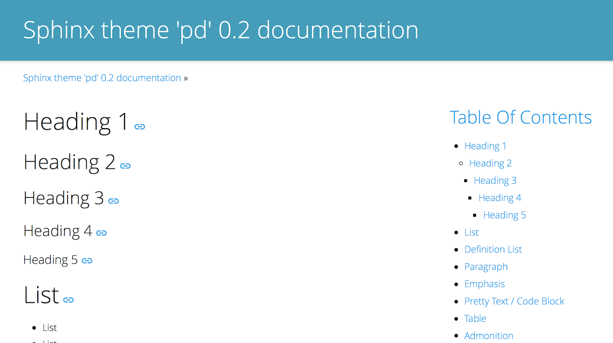
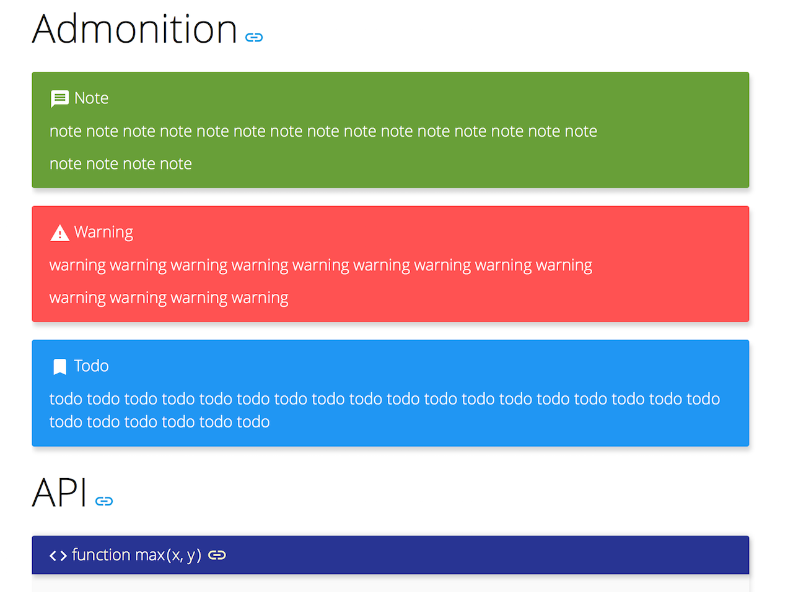
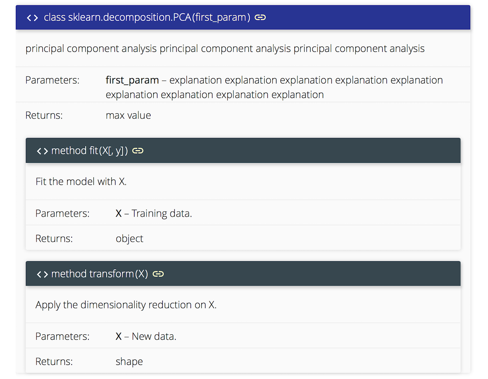
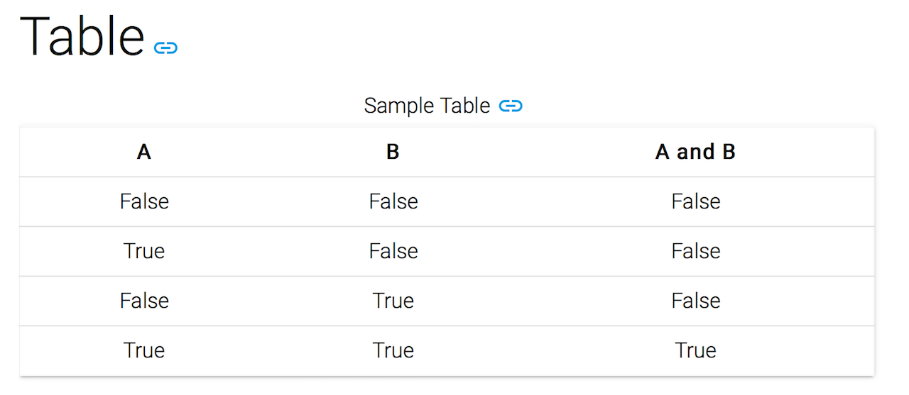

Sphinx Theme 'pd'
=================

Material Design theme for `Sphinx`_

Sample
------

* https://sphinx-theme-pd.netlify.com/

Screen shot
-----------

Installation
------------

1. pip install

.. code::

   $ pip install sphinx_theme_pd

2. Edit your conf.py

.. code::

   import sphinx_theme_pd
   html_theme = "sphinx_theme_pd"
   html_theme_path = [sphinx_theme_pd.get_html_theme_path()]

Build
-----

.. code::
   $ yarn
   $ webpack

.. _Sphinx: http://sphinx-doc.org
